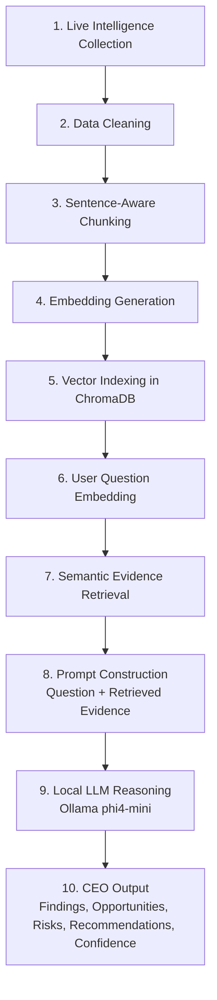

# AI CEO: SAP Strategic Intelligence Agent

## 1. Project Overview

This project is a local AI-powered Strategic Intelligence Agent for SAP. It collects live public information from company, market, competitor, technology, and research sources, processes the data into a searchable knowledge base, retrieves relevant evidence using semantic search, and generates CEO-level recommendations using a local Ollama language model.

The central business question is:

> If you were the CEO of SAP today, what would you do next and why?

The system is not only a news summarizer. It is designed to convert live public signals into evidence-backed opportunities, risks, trends, and strategic actions for executive decision support.

## 2. Company and Business Context

| Item | Description |
|---|---|
| Company | SAP |
| Industry | Enterprise Software / ERP / Cloud / Business AI |
| Use case | Strategic intelligence and CEO decision support |
| Main user | Executive decision-maker, strategy analyst, or business intelligence team |

SAP is suitable for this project because it operates in a fast-changing enterprise software market involving cloud migration, ERP modernization, business AI, automation, and competition from companies such as Oracle, Microsoft, Salesforce, and Workday.

## 3. Technology Stack

| Layer | Technology Used | Purpose |
|---|---|---|
| Programming language | Python | Core implementation |
| Dashboard | Streamlit | Interactive executive dashboard |
| Data collection | feedparser, arXiv API, RSS feeds | Live public data collection |
| Web/text cleaning | BeautifulSoup, regular expressions | HTML removal and text normalization |
| Data processing | pandas | CSV processing, cleaning, filtering, deduplication |
| Embedding model | all-MiniLM-L6-v2 | Converts text chunks into semantic vectors |
| Vector database | ChromaDB | Stores embeddings and metadata for similarity search |
| Retrieval method | Semantic similarity search | Finds evidence relevant to user questions |
| Local LLM | Ollama with phi4-mini | Generates CEO-style strategic answers locally |
| Storage | CSV files and ChromaDB | Stores raw data, processed data, chunks, and vector index |
| Launcher / refresh | start_dashboard.py | Starts dashboard and refreshes pipeline every 4 hours |

## 4. System Architecture Diagram


### Architecture Explanation

The system follows a layered Retrieval-Augmented Generation architecture. Public data sources are collected by a reusable live collector. The collected data is stored as raw CSV files, cleaned into a master dataset, split into sentence-aware chunks, embedded using a sentence transformer model, and stored in ChromaDB. When the user asks a strategic question, the retriever searches ChromaDB for relevant evidence chunks. These retrieved chunks are passed with the question to a local Ollama model, which generates a structured CEO-level response. The final output is displayed in the Streamlit dashboard together with supporting evidence.

## 5. Data Flow Diagram

```mermaid
flowchart LR
    A[Live public sources] --> B[collectors/live_collect.py]
    B --> C[data/raw/all_sources.csv]
    C --> D[processing/clean.py]
    D --> E[data/processed/master_data.csv]
    E --> F[processing/chunk.py]
    F --> G[data/processed/chunks.csv]
    G --> H[rag/vector_store.py]
    H --> I[ChromaDB vector store]
    J[User question in Streamlit] --> K[rag/retriever.py]
    I --> K
    K --> L[Relevant evidence chunks]
    L --> M[agents/ceo_agent.py]
    J --> M
    M --> N[Ollama phi4-mini response]
    N --> O[Dashboard output\nCEO briefing, opportunities, risks, recommendations, evidence]
```



### Data Flow Explanation

1. Live public data is collected from SAP News, Google News RSS feeds, and arXiv.
2. The raw collected records are stored in `data/raw/all_sources.csv`.
3. The cleaning layer removes noisy text, normalizes schema, filters weak records, and removes duplicates.
4. The cleaned dataset is saved as `data/processed/master_data.csv`.
5. Long documents are split into sentence-aware chunks and saved as `data/processed/chunks.csv`.
6. Each chunk is converted into a semantic embedding using `all-MiniLM-L6-v2`.
7. Chunks, embeddings, and metadata are stored in ChromaDB.
8. A user asks a strategic question from the Streamlit dashboard.
9. The retriever embeds the question and finds the most relevant chunks from ChromaDB.
10. The retrieved evidence and question are sent to the local Ollama model.
11. The dashboard displays the generated CEO briefing and supporting evidence.

## 6. AI Pipeline

The AI pipeline uses Retrieval-Augmented Generation rather than relying only on the language model's internal knowledge.



### AI Pipeline Steps

1. **Live Intelligence Collection**  
   The system collects public data from SAP News Center RSS, Google News RSS queries, and arXiv research APIs.

2. **Data Cleaning**  
   Raw HTML and noisy text are cleaned. Required fields are normalized, short or empty records are removed, duplicates are dropped, and the final clean dataset is saved as `master_data.csv`.

3. **Sentence-Aware Chunking**  
   Long documents are split into smaller chunks with overlap. The final implementation uses sentence-aware chunking so retrieved evidence does not start or end in the middle of words or sentences.

4. **Embedding Generation**  
   Each chunk is converted into a 384-dimensional vector using the `all-MiniLM-L6-v2` sentence transformer model.

5. **Vector Storage**  
   Chunks, embeddings, and metadata are stored in a persistent ChromaDB collection named `sap_strategic_intelligence`.

6. **Question Embedding**  
   When a user asks a strategic question, the question is also converted into an embedding using the same embedding model.

7. **Semantic Retrieval**  
   ChromaDB compares the question embedding with stored chunk embeddings and returns the most relevant evidence chunks.

8. **Prompt Construction**  
   The retrieved evidence is formatted with title, source, date, URL, and text, then combined with the user's question.

9. **Local LLM Generation**  
   The evidence-based prompt is sent to the local Ollama model `phi4-mini`. The model is instructed to use only the retrieved evidence and return a structured CEO-style answer.

10. **Dashboard Output**  
   The final answer is displayed in Streamlit with sections for direct answer, key findings, opportunities, risks, strategic recommendations, CEO briefing, confidence score, and supporting evidence.

## 7. Sources Used

The source list is configured in `config.py`. The final project uses the following live public sources:

| Source | Category | Purpose |
|---|---|---|
| SAP News Center RSS | Company | Official SAP announcements and company updates |
| Google News - SAP | News | General SAP-related market news |
| Google News - SAP Investor Relations | Market | Earnings, investor, and financial market signals |
| Google News - Competitors | Competitor | Signals from Oracle, Salesforce, Microsoft Dynamics, Workday, and related competitors |
| Google News - Enterprise AI Trends | Trend | Enterprise AI, ERP, cloud, and automation trends |
| arXiv - Enterprise AI Research | Research | Academic research related to enterprise AI and cloud computing |
| arXiv - RAG and AI Agents Research | Research | Academic research related to RAG, AI agents, and business intelligence |

## 8. Dataset Snapshot

This project does not use a fixed static external dataset. The dataset is generated by the live collection pipeline. The included CSV files represent the latest collected snapshot at the time of submission.

| File | Description | Records in submitted snapshot |
|---|---|---:|
| `data/raw/all_sources.csv` | Raw records collected from all configured public sources | 468 |
| `data/processed/master_data.csv` | Cleaned, normalized, and deduplicated records | 453 |
| `data/processed/chunks.csv` | Sentence-aware chunks used for embedding and retrieval | 1093 |

The dataset can be regenerated by running:

```powershell
python run_pipeline.py
```

Running the pipeline recreates the raw files, processed files, chunks, embeddings, and ChromaDB vector store.

## 9. Project Structure

```text
sap_project_Final/
│
├── agents/
│   ├── __init__.py
│   └── ceo_agent.py
│
├── collectors/
│   ├── __init__.py
│   └── live_collect.py
│
├── dashboard/
│   ├── app.py
│   └── test_ollama.py
│
├── data/
│   ├── raw/
│   │   ├── all_sources.csv
│   │   └── individual source CSV files
│   └── processed/
│       ├── master_data.csv
│       ├── chunks.csv
│       └── scheduler_status.json
│
├── processing/
│   ├── __init__.py
│   ├── clean.py
│   ├── chunk.py
│   └── embeddings.py
│
├── rag/
│   ├── __init__.py
│   ├── retriever.py
│   └── vector_store.py
│
├── chroma_db/
├── config.py
├── run_pipeline.py
├── start_dashboard.py
├── requirements.txt
└── README.md
```

## 10. Dashboard Sections

The Streamlit dashboard contains the following sections:

1. **Overview**  
   Shows the company, industry, document count, source count, latest update time, and pipeline status.

2. **Market Intelligence**  
   Organizes intelligence into market, competitor, technology, company, and research views.

3. **Opportunity & Risk**  
   Displays keyword-based opportunity and risk signals found in the collected dataset.

4. **Sentiment**  
   Shows basic sentiment analysis across the processed intelligence data.

5. **CEO Briefing**  
   Allows the user to ask a strategic question and receive an evidence-backed CEO-style answer using the RAG pipeline.

6. **Data Explorer**  
   Allows inspection of the processed records used by the system.

## 11. Important Design Decisions

### 11.1 Why use RSS feeds and public APIs?

RSS feeds and public APIs are free, lightweight, and suitable for a one-week academic prototype. They allow the system to collect live public information without requiring paid commercial APIs.

### 11.2 Why use one generalized collector?

The project uses one reusable collector, `collectors/live_collect.py`, instead of separate duplicate scripts for each source. Source details are stored in `config.py`, and the collector loops through all configured sources. This makes the system easier to extend because a new source can be added by updating the configuration instead of rewriting the collection logic.

### 11.3 Why use sentence-aware chunking?

The original fixed character-based chunking could cut words and sentences in the middle. The final implementation uses sentence-aware chunking so retrieved evidence is cleaner and easier to read, while still keeping overlap between chunks.

### 11.4 Why use `all-MiniLM-L6-v2`?

`all-MiniLM-L6-v2` is small, fast, and effective for semantic search. It is appropriate for a local project because it creates good sentence embeddings without requiring heavy GPU resources.

### 11.5 Why use ChromaDB?

ChromaDB is a lightweight local vector database. It stores embeddings, document text, and metadata, and supports similarity search without requiring a separate database server.

### 11.6 Why use Ollama?

Ollama allows the project to use a local open-source language model instead of paid APIs. This keeps the system cost-effective and suitable for academic demonstration.

### 11.7 Why use RAG?

RAG makes the answer more grounded. Instead of asking the LLM to answer only from its internal knowledge, the system first retrieves relevant evidence from the local knowledge base and passes that evidence to the LLM.

### 11.8 Why use a local dashboard?

Streamlit allows fast development of an interactive dashboard. It is suitable for showing the pipeline output, intelligence views, and CEO briefing in one place.

### 11.9 Why use automatic refresh?

Strategic intelligence should stay current. `start_dashboard.py` checks whether processed data and ChromaDB exist and refreshes the pipeline every 4 hours using `AUTO_REFRESH_HOURS` from `config.py`.

## 12. How to Run

### Step 1: Install dependencies

```powershell
pip install -r requirements.txt
```

### Step 2: Install and start Ollama

Install Ollama on the system, then pull the configured model:

```powershell
ollama pull phi4-mini
```

Start Ollama:

```powershell
ollama serve
```

Keep this terminal open.

### Step 3: Run the complete pipeline

In a second terminal, run:

```powershell
python run_pipeline.py
```

This performs:

1. Live data collection
2. Data cleaning
3. Sentence-aware chunking
4. Embedding generation
5. ChromaDB indexing

### Step 4: Start the dashboard

```powershell
python start_dashboard.py
```

The dashboard opens at:

```text
http://localhost:8501
```

`start_dashboard.py` is preferred because it checks whether the processed data and vector database are available and fresh before opening the dashboard.

Alternatively, the dashboard can be started directly with:

```powershell
streamlit run dashboard/app.py
```

## 13. Main Files and Their Roles

| File | Role |
|---|---|
| `config.py` | Stores source configuration, folder paths, model names, collection name, and refresh interval |
| `collectors/live_collect.py` | Collects live data from RSS feeds and arXiv API |
| `processing/clean.py` | Cleans raw data and creates `master_data.csv` |
| `processing/chunk.py` | Creates sentence-aware chunks and saves `chunks.csv` |
| `rag/vector_store.py` | Creates embeddings and builds the ChromaDB vector store |
| `rag/retriever.py` | Retrieves relevant chunks for a user question |
| `agents/ceo_agent.py` | Sends retrieved evidence to Ollama and generates CEO-level answers |
| `dashboard/app.py` | Streamlit dashboard interface |
| `run_pipeline.py` | Runs collection, cleaning, chunking, embedding, and indexing |
| `start_dashboard.py` | Starts the dashboard and manages 4-hour refresh logic |

## 14. Common Problems and Fixes

### ChromaDB collection not found

If ChromaDB gives a collection error, stop the dashboard, delete the old ChromaDB folder, and rebuild the pipeline:

```powershell
rmdir /s /q chroma_db
python run_pipeline.py
python start_dashboard.py
```

### Ollama connection error

Make sure Ollama is running and the model has been pulled:

```powershell
ollama serve
ollama pull phi4-mini
```

### Dashboard does not open automatically

Open it manually in the browser:

```text
http://localhost:8501
```

### Dashboard still shows old layout

Stop Streamlit with `Ctrl + C`, restart the dashboard, and make sure the updated dashboard file is saved as:

```text
dashboard/app.py
```

## 15. Final Summary

The SAP Strategic Intelligence Agent is a local RAG-based AI system for executive decision support. It collects live public intelligence, processes it into a searchable vector knowledge base, retrieves relevant evidence for strategic questions, and generates CEO-level recommendations using a local Ollama model. The system combines data engineering, semantic search, vector databases, local LLM reasoning, and dashboard visualization into one end-to-end AI pipeline.
